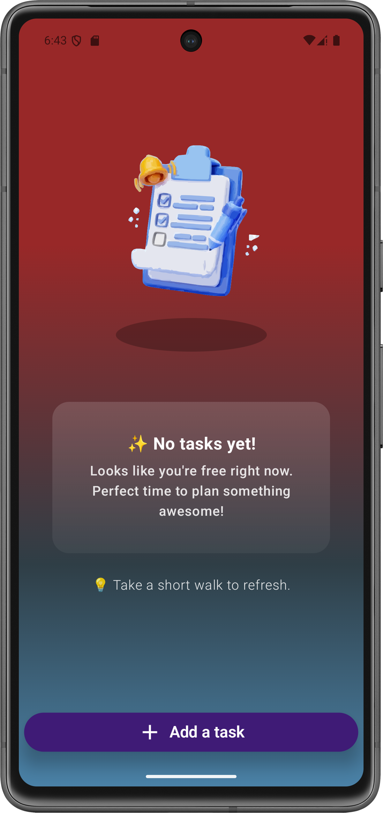
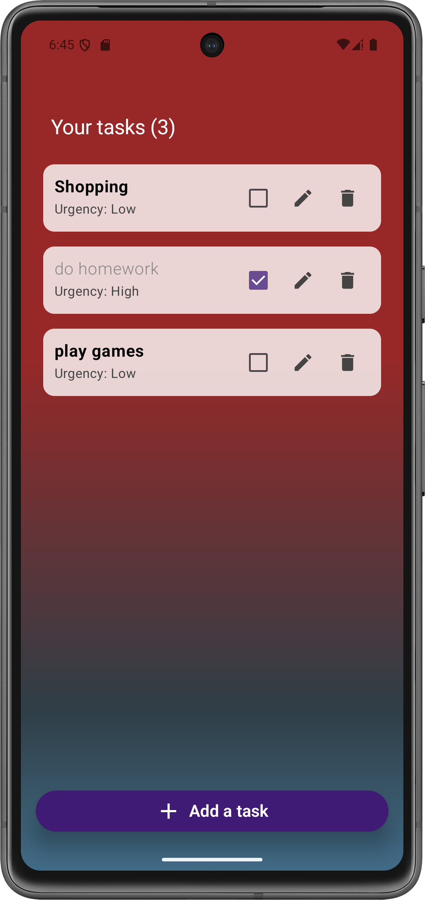

# 📝 Task Planner App

A clean and minimal Jetpack Compose-based to-do list app that helps you stay focused and productive.

---

## 🚀 Features

- 🗂️ Add, edit, and delete tasks effortlessly
- 🎯 Mark tasks with urgency levels (Low, Moderate, High)
- 📅 Auto-expandable UI with animations
- 🌈 Modern gradient styles and dark/light theme support
- 📭 Empty state with encouraging messaging and animation
- 📸 In-app visual guide using animated icons
- ✅ Built using **Jetpack Compose** with smooth UI transitions

---

## 📷 Screenshots

<p align="center">
  
  
  <br>
  
  
</p>
---

## 🛠️ Tech Stack

- Kotlin & Jetpack Compose
- Material Design 3
- AndroidX Libraries
- Compose Animations
- State Management via `remember` and `mutableStateOf`

---

## 📦 How to Run

1. Clone the repository:
   ```bash
   git clone https://github.com/yourusername/task-planner.git

2. Open in Android Studio.

3. Run the app on an emulator or physical device.

🙌 Contributing

Pull requests are welcome! Feel free to fork and suggest improvements.
